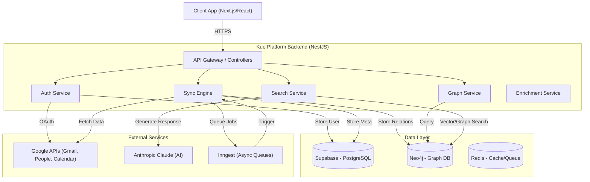

# Kue Platform - Professional Network Intelligence

Kue Platform is a professional network intelligence tool designed to help you leverage your existing connections. By synchronizing with your email, calendar, and contacts, it builds a private knowledge graph of your professional network, allowing you to search for introductions, identify relationship strengths, and uncover hidden opportunities.

## High-Level Design (HLD)



## Modules

### 🔐 Authentication (`/auth`)
Handles user identity and secure access.
-   **OTP Login**: Passwordless email authentication for seamless entry.
-   **Google OAuth**: Connects Google accounts to authorize data synchronization (Gmail, Contacts, Calendar).
-   **Session Management**: JWT-based access and refresh tokens.

### 🔄 Synchronization (`/sync`)
The core engine that ingests data from external sources.
-   **Gmail Sync**: Analyzes email metadata to identify connections and interaction frequency.
-   **Contacts Sync**: Imports Google Contacts to build the base network.
-   **Calendar Sync**: Tracks meetings to gauge relationship recency and strength.
-   **Incremental Syncs**: Efficiently updates only changed data.

### 🕸️ Graph (`/graph`)
Manages the relationship data in Neo4j.
-   **Person Nodes**: Represents individuals in your network.
-   **Interaction Edges**: Represents emails, meetings, and other touchpoints.
-   **Strength Calculation**: Algorithms to determine how close you are to a contact based on interaction frequency and recency.

### 🔍 Search (`/search`)
AI-powered natural language search interface.
-   **Semantic Search**: Understands queries like "Investors in AI" or "Engineers at Google".
-   **Intro Paths**: Finds the best path to a target person through mutual connections.
-   **LLM Summarization**: Generates human-readable summaries of search results using Claude.

### 🤖 Enrichment (`/enrichment`)
Enhances contact data.
-   **Profile Augmentation**: Fills in missing details like job titles, companies, and social profiles.
-   **Deduplication**: Merges duplicate contacts across different sources.

## Observability Stack

We use a comprehensive suite of tools to monitor health, performance, and user behavior:

| Tool | Purpose | Why we use it |
|------|---------|---------------|
| **Sentry** | Error Tracking | Real-time alerts for backend exceptions and performance bottlenecks. Integrated with NestJS to capture stack traces and context. |
| **PostHog** | Analytics & Feature Flags | Tracks user events (e.g., "Sync Started", "Search Performed") to understand usage patterns. control feature rollouts. |
| **BetterStack** | Logging | Centralized, structured logging (via Logtail). Allows querying logs across distributed services. |
| **Grafana Cloud** | Metrics & Traces | Visualizes OpenTelemetry data. Dashboards for API latency, memory usage, and job queue depths. |
| **OpenTelemetry** | Instrumentation | Vendor-neutral standard for collecting traces and metrics from the NestJS application. |

## Technology Stack

-   **Framework**: [NestJS](https://nestjs.com/) (Fastify adapter)
-   **Language**: TypeScript
-   **Database (Relational)**: [Supabase](https://supabase.com/) (PostgreSQL)
-   **Database (Graph)**: [Neo4j Aura](https://neo4j.com/cloud/aura/)
-   **Queue/Background Jobs**: [Inngest](https://www.inngest.com/)
-   **AI/LLM**: [LangChain](https://js.langchain.com/) + [Anthropic Claude](https://www.anthropic.com/)
-   **Cache/Rate Limit**: [Upstash Redis](https://upstash.com/)

## Getting Started

### Prerequisites
-   Node.js (v18+)
-   npm or pnpm
-   Accounts for: Supabase, Neo4j, Inngest, Google Cloud Console, Anthropic.

### 1. Environment Setup
Copy the example environment file and fill in your credentials:

```bash
cp .env.example .env
```

Refer to `.env.example` for the required keys.

### 2. Installation

```bash
npm install
```

### 3. Running the App

```bash
# Development mode
npm run start:dev

# Production mode
npm run start:prod
```

### 4. Documentation
For detailed API usage, refer to [API_DOCUMENTATION.md](./API_DOCUMENTATION.md).
